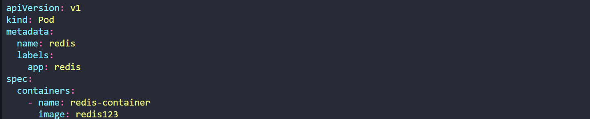

## Kubernetes Architecture

1. Nodes (= Minions)

- 쿠버네티스가 설치되는 물리적 가상머신

- Node는 작업자 머신으로 쿠버네티스가 컨테이너를 런칭하는 곳

- Node가 실패한다면 application이 다운되니 하나 이상의 Node 필요 => `Cluster` 등장

2. Cluster

- Cluster란 Node의 집합

- 하나의 Node가 실패해도 다른 Node에서 application에 접근 가능

- 다수의 Node는 Load 공유에도 도움

3. Master Node

- 쿠버네티스가 설치된 또 다른 Node

- Cluster에서 Node 관리 
    - 실제 orchestration 책임 
    - Cluster 멤버에 대한 정보 
    - Monitoring 관리 
    - Node가 실패하면 실패한 Node의 작업을 다른 작업자 Node로 옮기는 역할

4. Components 

🔸 System에 Kubernetes를 설치할 구성 요소

- `API Server`
    - Kubernetes의 프론트엔드처럼 작동
    - user, management device, command line interface 모두 API Server에 통신해 Kubernetes Cluster와 상호작용

- `etcd`
    - 분산되고 신뢰할 수 있는 Key-value 저장소
    - Kubernetes가 Cluster 관리에 사용되는 모든 데이터를 저장하는데 사용
    - Ex. Cluster에 Node와 Master가 여러 개씩 존재하는 경우, Cluster 내 모든 Node에 관한 정보를 분산 방식으로 저장  
    - Cluster 내에서 잠금장치 구현 => Master 간의 충돌이 없도록

- `kubelet`
    - Cluster의 각 Node에서 실행되는 agent
    - 예상대로 Container가 Node에서 실행되는지 확인

- `Container Runtime`
    - Container를 실행하는 데 사용되는 기본 소프트웨어
    - Ex. Docker

- `Controller`
    - orchestration을 지휘하는 두뇌 
    - Node, Container, Endpoint가 다운될 때 인지하고 대응하는 역할로, 해당 경우 새 container를 들여올지 결정

- `Scheduler`
    - 다중 노드에 걸친 작업이나 Container 배포 담당
    - 새로 생성된 Container를 찾아 Node에 할당 

5. Master vs Worker Nodes
: Server의 유형은 Master와 Worker로 나뉨

- Master Node
    - `kube-apiserver`를 가지기에 Master Node가 됨
    - 수집된 모든 Node의 정보는 `etcd`에 Key-value 형태로 저장
    - `controller`와 `scheduler` 존재 

- Worker Node
    - 모든 worker node에는 `kubelet`이 있어 Master Node와 상호 작용 => Worker Node의 health 정보를 제공하고 Master Node가 요청한 작업 수행

    - Container(ex.Docker container)가 Hosting 되는 곳
    - System에서 Docker container를 실행하려면 Container Runtime이 설치되어야 함
    - 본 강의에서는 Container Runtime으로 Docker 사용할 것

6. kubectl

- Cluster 상의 application을 배포 및 관리하는데 사용
- Cluster 정보를 얻고 Cluster 내의 다른 Node의 상태를 얻을 수 있고 많은 것을 관리할 수 있음
- `kubectl run` : cluster에 application을 배포
- `kubectl cluster-info` : cluster 정보 조회
- `kubectl get nodes` : cluster 내의 모든 node를 나열

## Docker vs ContainerD

1. Docker와 Kubernetes

- container 초기에는 Docker가 가장 지배적인 container 도구가 됨 
- 이후 Kubernetes가 Docker와의 orchestration`만`을 담당
- Kubernetes가 container orchestrator로 인기가 높아졌고 다른 container runtime이 들어오길 원함 => Kubernetes가 `Container Runtime Interface(CRI)` 도입. CRI를 사용해 `OCI 표준을 준수`하는 어떤 공급업체든 Kubernetes의 container runtime을 지원해 Kubernetes의 container runtime으로 작업하게 해줌
    - Ex. ctr, nerdctl, crictl

- Docker는 CRI 등장 전부터 사용했기에 표준을 지원하려고 만든 것이 아님
- Kubernetes가 `dockershim` 도입 => container runtime interface 밖에서 Docker를 지원하는 임시 방편
- Docker에는 Container runtime만 가지는 것이 아님 
    - Docker CLI, Docker API, Build(image 구축을 돕는 빌드 도구), Volumes, Auth, Security, ContainerD(container runtime. daemon)
    - `Contianerd`는 CRI 호환이 가능하고 다른 runtime처럼 Kubernetes와 직접적으로 작업 가능
    - Containerd는 Docker와 별도로 자체 Runtime으로 사용 가능
- dockershim을 유지하기 불편 => `Kubernetes가 dockershim 지원 중단`
- docker image는 OCI의 imagespec을 따르기에 계속 작동. container로 계속 작업하지만 Docker 자체는 Kubernetes 지원 runtime에서 제거  

2. OCI (Open Container Initiative)

- `imagespec`과 `runtimespec`으로 구성

- imagespec은 image를 어떻게 만들어야 하는지 사양에 대한 정의

- runtimespec은 container runtime 개발에 대한 표준 정의

3. Containerd

- Docker의 일부지만 현재는 독립된 프로젝트
- Docker의 다른 기능이 필요없는 경우 전체를 설치할 필요없이 containerd만을 설치해 container만 설치 가능 
- Docker가 설치되어있지않고 containerd만 설치된 경우(container만 장착된 container) 실행 방법 
    - `ctr` 명령어 사용
    - `nerdctl` 명령어 사용
        - ctr 명령어에 비해 좋은 대안    
        - docker와 매우 유사한 명령어로 container를 위한 Docker 명령어와 비슷한 CLI. `docker` 대신 `nerdctl`로 변경해 사용

4. CLI 명령어

- `ctr` 명령어 사용
    - ctr 명령어는 `디버깅 container를 위해서만` 만들어졌고 제한된 기능만 제공하기에 사용자 친화적이지 않음
    - ctr 명령어는 image를 가져오는 것과 같은 container 관련 작업을 수행할 때 사용
    - `ctr images pull [image주소]` : image pull
    - `ctr run [image주소]` : container 실행
- `nerdctl` 명령어 사용
    - ctr 명령어에 비해 좋은 대안    
    - docker와 매우 유사한 명령어로 container를 위한 Docker 명령어와 비슷한 CLI. `docker` 대신 `nerdctl`로 변경해 사용
    - docker가 지원하는 대부분의 옵션을 지원하고 이외의 container에 구현된 최신 기능에 대한 접근 권한 제공
    - `nerdctl run` : container 생성
    - `nerdctl run --name webserver -p 80:80 -d nginx` : p 옵션으로 포트 매핑
- `crictl`
    - commandline utility로 CRI 호환 가능한 container runtime과 상호작용하는데 사용
    - 모든 다양한 container runtime에 걸쳐 작동
    - containerd를 위해 ctr과 nerdctl를 만들었고, crictl은 kubernetes 관점에서 다른 container runtime에 걸쳐 작동 => 별도로 설치되어야 하고 container runtime 검사에 사용
    - `crictl`은 디버깅 도구. container를 만들 수 있지만 쉽지 않음
    - container 생성하지 못하는 이유: kubelet과 함께 동작 => kubelet이 container와 pod를 Node에서 한 번에 이용가능하도록 하지만 그렇기 때문에 `crictl로 container를 만들어도 kubelet이 알지 못하기 때문에 바로 삭제됨`
    - `crictl pull [image명]` : image pull
    - `crictl images` : 존재하는 모든 image 조회
    - `crictl ps -a` : container 목록 조회
    - `crictl exec -i -t [container Id] ls` : 해당 container 실행
    - `crictl logs [container Id]` : log 확인
    - `crictl pods` : pod 조회 가능 => Docker와의 차이점

📌 요약하면 `ctr` 명령어는 containerd와 함께 제공되고 작동되며 디버깅 목적으로만 제한된 기능만 사용 가능, `nerdctl` 명령어는 container를 위한 Docker 같은 CLI로 container를 만드는데 일반적으로 사용되고 Docker CLI와 같거나 그 이상 제공. `crictl` 명령어는 kubernetes community에서 온 CRI(Container Runtime Interface)와 호환 가능한 runtime과 상호작용하는데 사용하며 모든 CRI-supported runtime을 위해 디버깅 목적으로 사용 가능

||ctr|nerdctl|crictl|
|:--:|:--:|:--:|:--:|
|Purpose|Debugging|General Purpose|Debugging|
|Community|ContainerD|ContainerD|Kubernetes|
|Works With|ContainerD|ContainerD|All CRI Compatible Runtimes|

## Pods

0. 가정

- Docker Image
- Kubernetes Cluster

1. Pod

- 최종 목표는 kubernetes의 worker node에 application을 container 형태로 배포하는 것
    - kubernetes는 worker node에 container를 직접 배포하지 않음 => pod 형태로 배포
- Pod는 application의 단일 instance이자 Kubernetes에서 만드는 가장 작은 단위
- Pod와 Container는 1:1 관계로, 하나의 Pod에 하나의 Container가 존재

2. Multi-Container Pods

- web application을 지원하는 `Helper Container`가 존재하는 경우 하나의 Pod에 여러 개의 container가 존재 
    - Helper container는 사용자와 데이터 처리 사용자가 업로드한 파일 처리 등의 일을 함
- application container와 helper container는 localhost라는 이름으로 같은 네트워크 공간에서 직접 통신 가능
- storage 공유 가능

3. Pod

- Docker 관점에서
- Docker host에 application 배포를 위한 프로세스 개발 중으로 가정
    - `docker run python-app` 명령어로 node에 application 배포 
    - 접근이 많아지면 위의 명령어를 많이 실행해 더 많은 application 배포
    - 다른 곳에서 데이터를 처리 또는 패치해 web application을 돕는 helper container 등장 => `docker run helper -link app`으로 이미 배포된 appication container와 1:1 관계를 유지하고 그 container로부터 데이터에 접근
    - container 간의 network connection을 직접 구축해야하며 공유할 수 있는 volume을 만들어 container 간의 데이터 공유 필요. 가장 중요한 것은 application container의 상태를 monitoring하고 container가 죽으면 helper container도 수동으로 죽여야 함. 새로운 container가 배포되면 새로운 helper container도 배포해야함
- 위의 모든 것은 Kubernetes의 pod가 자동으로 해줌
    - pod를 구성하는 container만 정의하면 pod의 container는 기본적으로 같은 storage와 network namespace 공유

4. kubectl

- `kubectl run nginx` : pod를 자동으로 생성하고 nginx라는 docker image instance 배포
    - Docker image는 Docker Hub repository에서 다운로드
- `kubectl get pods` : 사용 가능한 pod 조회
- kubectl 명령어로 pod가 running 중이어도 외부 사용자는 access할 수 없음. node에서 내적으로 access는 가능

## Pods with YAML

1. YAML in Kubernetes
- Root level properties
    - `apiVersion` : object를 생성할 때 사용하는 Kubernetes API version
    - `kind` : 생성하고자하는 object type

    |Kind|Version|
    |:--:|:--:|
    |Pod|v1|
    |Service|v1|
    |ReplicaSet|apps/v1|
    |Deployment|apps/v1|  

    - `metadata` : object에 대한 data. Child로 `name` (pod 이름), `labels` (원하는대로 key-value 지정 가능해 object 식별을 도움. app은 application 이름)만을 가짐

    - `spec` : 생성하고자하는 object에 대한 추가 정보를 kubernetes에 제공. Child로 `containers`를 가지며 이는 여러 개의 container가 pod에 존재할 수 있기에 List/Array. List/Array이기에 `containers` 항목의 첫 번째 Child마다 `-`를 넣어 구분

- `pod-definition.yml`
```
apiVersion: v1
kind: Pod
metadata:
    name: myapp-pod
    labels:
        app: myapp
        type: front-end
spec:
    containers:
        - name: nginx-container
          image: nginx
```

- `kubectl create -f pod-definition.yml` 명령어로 pod 생성

2. Commands

- `kubectl get pods` : pod 조회
- `kubectl describe pod myapp-pod` : myapp-pod 이름의 pod 상세 정보 조회

## Demo - Creating Pods with YAML

- 편집기 사용해 YAML 파일 생성 => `PyCharm` 사용
- 실제 시험에서는 PyCharm 사용 X. `vi` 또는 `nano`와 같은 Linux에서 사용 가능한 편집기 사용해야함

## ReplicaSets

1. Controller

- Kubernetes의 두뇌 역할
- Kubernetes를 monitoring하고 그에 따라 반응하는 프로세스

2. Replication Controller

- application이 실행되는 단일 pod가 다운되면 사용자는 application에 접근할 수 없어짐 => 하나의 pod가 다운되도 사용자가 application에 접근할 수 있도록 하기 위해 하나 이상의 instance 또는 pod 필요

- Replication Controller는 Kubernetes cluster의 단일 pod에 다중 instance를 실행하도록 도움 => High Availability 제공
- Pod가 하나라고 해도 Replication Controller가 기존의 pod가 고장나는 경우 자동으로 새 pod 생성해줌
- Replication Controller는 `특정 pod가 항상 실행되도록 보장`

3. Load Balancing & Scaling

- Replication Controller는 여러 개의 pod를 생성해 Load를 공유하기 위해서도 필요
- Replication Controller는 cluster 내의 여러 개의 Node에 걸쳐있어 서로 다른 Node의 여러 Pod에 걸쳐 `부하를 분산하는데 도움이 됨`
- Replication Controller는 수요가 증가하면 application `scaling 가능`

4. ReplicationController 

- ReplicationController는 여러 개의 pod를 생성할 수 있기에 pod의 template을 정의해야함 : spec>template

- `rc-definition.yml`
```
apiVersion: v1
kind: ReplicationController
metadata:       #ReplicationController용 metadata
    name: myapp-rc
    labels:
        app: myapp
        type: front-end
spec:           #ReplicationController용 spec
    template:   
        metadata:   #Pod용 metadata
            name: myapp-pod
            labels:
                app: myapp
                type: front-end
        spec:       #Pod용 spec
            containers:
                - name: nginx-container
                  image: nginx
    replicas: 3
```

- `kubectl create -f rc-definition.yml` 명령어로 replicationcontroller 생성
    - pod를 replicas만큼 생성

- `kubectl get replicationcontroller` 명령어로 replicationcontroller 조회

- `kubectl get pods` 명령어로 pod 확인
    - pod 이름이 모두 replicationcontroller 이름으로 시작

5. ReplicaSet

- ReplicationController와 다른 점은 `apiVersion`이 apps/v1이고, spec의 CHild로 `selector` 존재
    - selector는 replicaset을 도와 replicaset 아래에 어떤 pod가 있는지 식별
    - replicaset은 `replicaset으로 만들어지지 않은 pod 관리 가능`하기 때문
    - selector>matchLabels 는 pod의 label과 아래에 지정된 label을 일치시킴. Replication controller는 이를 지원하지 않음

- `replicaset-definition.yml`
```
apiVersion: apps/v1 #Replication Controller와의 차이점
kind: ReplicaSet
metadata:       
    name: myapp-replicaset
    labels:
        app: myapp
        type: front-end
spec:          
    template:   
        metadata:  
            name: myapp-pod
            labels:
                app: myapp
                type: front-end
        spec:       
            containers:
                - name: nginx-container
                  image: nginx
    replicas: 3
    selector:   #Replication Controller와의 차이점
        matchLabels:
            type: front-end
```

- `kubectl create -f replicaset-definition.yml`
- `kubectl get replicaset`
- `kubectl get pods`

6. Labels and Selectors

- 복제본 pod들을 selector>matchLabels을 사용해 pod에 labels를 붙이듯 붙여 replicaset이 어느 pod를 monitoring할지 알 수 있음

7. Scale

- definition file의 replicas 수정
    - YAML 파일 수정 후 `kubectl replace -f replicaset-definition.yml`로 업데이트

- kubectl scale 명령어 사용
    - `kubectl scale --replicas=6 -f replicaset-definition.yml`으로 definition file 수정 => 단, 명령어로 수정하였으므로 파일 자체의 코드가 변경되지는 않음
    - `kubectl scale --replicas=6 [TYPE] [REPLICASET NAME]`으로 replicaset 수정

8. Command

- `kubectl create -f [YAML 파일명]` : replicaset 또는 입력으로 제공하는 파일에 따라 Kubernetes object 생성

- `kubectl get replicaset` : replicaset 조회
- `kubectl delete [object kind] [object 이름]` : 해당 object 삭제
- `kubectl replace -f [YALM 파일명]` : 파일 수정 후 명령어를 사용해 object update
- `kubectl scale --replicas=[replicas 개수] -f [YAML 파일명]` : 파일의 replicas를 지정한 개수로 변경. 실제 파일이 변경되지는 않음

## Deployments

1. Deployment

- Deployment는 Kubernetes의 object로, container를 감싼 pod의 상위 계층이 replicaset, 여러 개의 Pod가 모인 ReplicaSet의 상위 계층
- instance를 매끄럽게 업그레이드하는 기능 제공 : Rolling update, Rollback, 일시중지, 재시작

- `deployment-definition.yml`
```
apiVersion: apps/v1 
kind: Deployment
metadata:       
    name: myapp-deployment
    labels:
        app: myapp
        type: front-end
spec:          
    template:   
        metadata:  
            name: myapp-pod
            labels:
                app: myapp
                type: front-end
        spec:       
            containers:
                - name: nginx-container
                  image: nginx
    replicas: 3
    selector:   
        matchLabels:
            type: front-end
```

2. Command

- `kubectl get all` : 모든 object 조회, Deployment를 생성한 경우 deployment, replicaset, pod 조회 가능
- ``

## Namespaces

1. Kubernetes Cluster

- Cluster의 `Default namespace`에 pod, deployment, service 등의 Object 생성
- Network, DNS 서비스와 관련된 내용은 `kube-system namespace` 
- `kube-public namespace`에는 모든 사용자가 사용할 수 있는 resource 생성

2. Namespace

- 사용자가 실수로 삭제하는 것을 막기 위해 namespace를 다르게 설정하여 분리
- 작은 cluster에서는 default namespace에서만 사용해도 괜찮지만, 기업이나 production 목적으로 Kubernetes Cluster를 성장시켜 사용할 때에는 namespace의 사용을 고려해야 함

3. Namespace 정책

- 각각의 namespace는 고유한 정책을 가질 수 있음
- namespace 각각에 resoucr 할당량을 지정할 수 있음

4. DNS

- Default namespace 안의 resource도 서로를 이름으로 부를 수 있음
- 같은 namespace(Default) 내의 경우, web-pod가 db-service 호출 가능 : `mysql.connect("db-service")`
- 다른 namespace의 경우에도 web-pod(Default namespace) 다른 service(dev namespace) 호출 가능
    - namespace 이름을 서비스의 이름에 추가해야 함
    - `mysql.connect("db-service.dev.svc.cluster.local")`
- Service가 생성될 떄 DNS 항목이 자동으로 포맷에 추가되기 때문
- `db-service.dev.svc.cluster.local`
    - 뒤부터 시작 : `cluster.local`은 domain, `svc`는 service, `dev`는 namespace, `db-service`는 service명을 가리킴

5. namespace에 object 생성

- `kubectl get pods` : Default namespace에 존재하는 pod만 조회
- `kubectl get pods --namespace=kube-system` : 원하는 namespace에 존재하는 pod 조회
- `kubectl create -f pod-definition.yml` : Default namespace에 Pod 생성
- `kubectl create -f pod-definition.yml --namespace=dev` : dev namespace에 Pod 생성
    - `--namespace=dev` 대신에 YAML 파일 내에 namespace 지정한 후 `kubectl create -f pod-definition.yml` 해도 동일
    ```
    apiVersion: v1
    kind: Pod
    metadata:
        name: myapp-pod
        namespace: dev  #namespace 설정
    ...
    ```

6. Namespace 생성

- yaml 파일로 생성 : 파일 생성 후 `kubectl create -f namespace-dev.yml`

`namespace-dev.yml`
```
apiVersion: v1
kind: Namespace
metadata:
    name: dev
```

- `kubectl create namespace dev` 명령어로 생성

7. Namespace Switch

- `kubectl config set-context $(kubectl config current-context) --namespace=dev` 명령어로 Default namespace에서 dev namespace로 switch
    - `kubectl get pods` 할 경우 dev namespace의 pod 조회
    - default namespace의 pod를 보고 싶은 경우 `kubectl get pods --namespace=default` 실행

- `kubectl get pods --all-namespaces` : 모든 namespace의 pod 조회
    - `kubectl get pods -A`도 동일한 출력

8. Resource Quota

- namespace에서 resource를 제한하려면 resource quota(할당량)을 생성해야함

- YAML 파일 생성 후 `kubectl create -f compute-quota.yaml`

`Compute-quota.yaml`
```
apiVersion: v1
kind: ResourceQuota
metadata:
    name: compute-quota
    namespace: dev
spec:
    hard:
        pods: "10"
        requests.cpu: "4"
        requests.memory: 5Gi
        limits.cpu: "10"
        limits.memory: 10Gi
```


## Labs 실습 

1. Pods

- 잘 모를 때에는 `kubectl run --help` 활용
- `kubectl get pods -o wide` 명령어로 IP, Node 확인 가능
- `kubectl get pods` 결과의 READY는 `Running Containers in POD / Total Containers in POD`
- pod 이름을 `redis`, image로 `redis123` 사용


- pod definition file이 없는 경우 아래 명령어를 통해 definition file 추출
`kubectl get pod <pod-name> -o yaml > pod-definition.yaml`


2. ReplicaSet

- replicaset 을 rs로 줄여 사용 가능

- ReplicaSet의 selector와 template

```
apiVersion: apps/v1
kind: ReplicaSet
metadata:
  name: replicaset-2
spec:
  replicas: 2
  selector:
    matchLabels:
      tier: nginx   #수정 전에는 frontend 였음. 아래의 pod template과 일치시켜야함
  template:
    metadata:
      labels:
        tier: nginx
    spec:
      containers:
      - name: nginx
        image: nginx
```

- 수정
    - `kubectl edit replicaset new-replica-set` 으로 바로 수정하면 바로 적용됨
    - `kubectl get replicaset new-replica-set -o yaml > new-replica-set.yaml` 명령어로 definition file 생성 후 원하는 코드로 수정 => 기존의 replicaset 삭제 후 수정한 yaml 파일 apply

3. Deployment

- deployment를 deploy로 줄여 사용 가능

4. Namespace

- namespace를 n 또는 ns으로 줄여 사용 가능

- 다른 namespace에 pod 생성할 때 `kubectl run redis --image=redis -n=finance` 명령어로 이름은 redis, image name도 redis, namespace가 finance인 pod 생성 가능

- 같은 namespace에 존재하는 서비스에 접근할 때에는 Blue test에서 Host Name `db-service`로 접근 가능하고, 다른 namespace에 존재할 떄 Blue test에서 Host Name `db-service.dev.svc.cluster.local`과 같이 설정

5. Imperative Commands

- `kubectl run redis --image=redis:alpine --dry-run=client -oyaml > redis-pod.yaml`로 yaml 파일 생성 
    - pod가 생성되지는 않음. yaml 파일만 생성

- labels를 지정하여 pod 생성 => `kubectl run redis --image=redis:alpine --labels="tier=db"` 와 같이 ""로 묶기

- namespace를 지정할 때에는 `-`가 한 개 !
- `kubectl expose pod redis --port=6379 --name=redis-service`를 `kubectl expose pod redis --port 6379 --name redis-service`처럼 작성 가능

## Exam Tips

- `kubectl [command] [TYPE] [NAME] -o <output_format>`

    - `-o` flag 사용해 세부 정보 출력 가능
        - `-o json` : API object 포맷을 JSON 포맷으로 출력
        - `-o name` : resource 이름만 출력
        - `-o wide` : 세부 정보를 텍스트 형식으로 출력
        - `-o yaml` : YAML 형식으로 출력

    - Ex. `kubectl create namespace test-123 --dry-run -o json`, `kubectl create namespace test-123 --dry-run -o yaml`, `kubectl get pods -o wide`
    - 참고: <https://kubernetes.io/docs/reference/kubectl/> <https://kubernetes.io/docs/reference/kubectl/cheatsheet/>

- 대부분 definition file을 사용하여 선언적 방식으로 작업 -> 명령어를 사용하면 작업을 빠르게 수행할 수 있을 뿐 아니라 정의 템플릿 쉽게 생성 가능
    - `--dry-run` : 기본적으로 명령을 실행하는 즉시 resource 생성. `--dry-run=client` 옵션을 사용하면 resource가 생성되지는 않지만 resource 생성할 수 있는지 여부와 명령이 올바른지 여부 알려줌
    - `-o yaml` : YAML 형식의 resource definition 출력

    - Pod
        - `kubectl run nginx --image=nginx` : NGINX pod 생성
        - `kubectl run nginx --image=nginx --dry-run=client -o yaml` : pod manifest yaml 파일

    - Deployment
        - `kubectl create deployment --image=nginx nginx` : deployment 생성
        - `kubectl create deployment --image=nginx nginx --dry-run -o yaml` : deployment yaml 파일
        - `kubectl create deployment nginx --image=nginx --replicas=4` : replicas가 4인 deployment 생성
        - `kubectl scale deployment nginx --replicas=4` : kubectl scale 명령어 사용 가능
        - `kubectl create deployment nginx --image=nginx--dry-run=client -o yaml > nginx-deployment.yaml` : definition file 저장 후 수정 
    
    - Service
        - `kubectl expose pod redis --port=6379 --name redis-service --dry-run=client -o yaml` 또는 `kubectl create service clusterip redis --tcp=6379:6379 --dry-run=client -o yaml` : `clusterIP` 타입의 service 생성 후 port 6379로 설정
        - `kubectl expose pod nginx --port=80 --name nginx-service --type=NodePort --dry-run=client -o yaml` 또는 `kubectl create service nodeport nginx --tcp=80:80 --node-port=30080 --dry-run=client -o yaml` : `nodePort` 타입의 service 생성 후 nginx port 80, nodeport는 30080

    - 참고: <https://kubernetes.io/docs/reference/kubectl/conventions/>

- `kubectl api-resources`로 줄임말 확인 가능

- 명령어 꿀팁 <https://kubernetes.io/docs/reference/kubectl/cheatsheet/>

- Kubernetes 관련 Blog <https://coffeewhale.com/k8s-isnt-containers>

- 자격증 응시 전 모의환경으로 2번 테스트 가능 => killer.sh