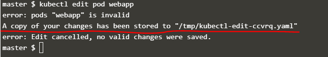
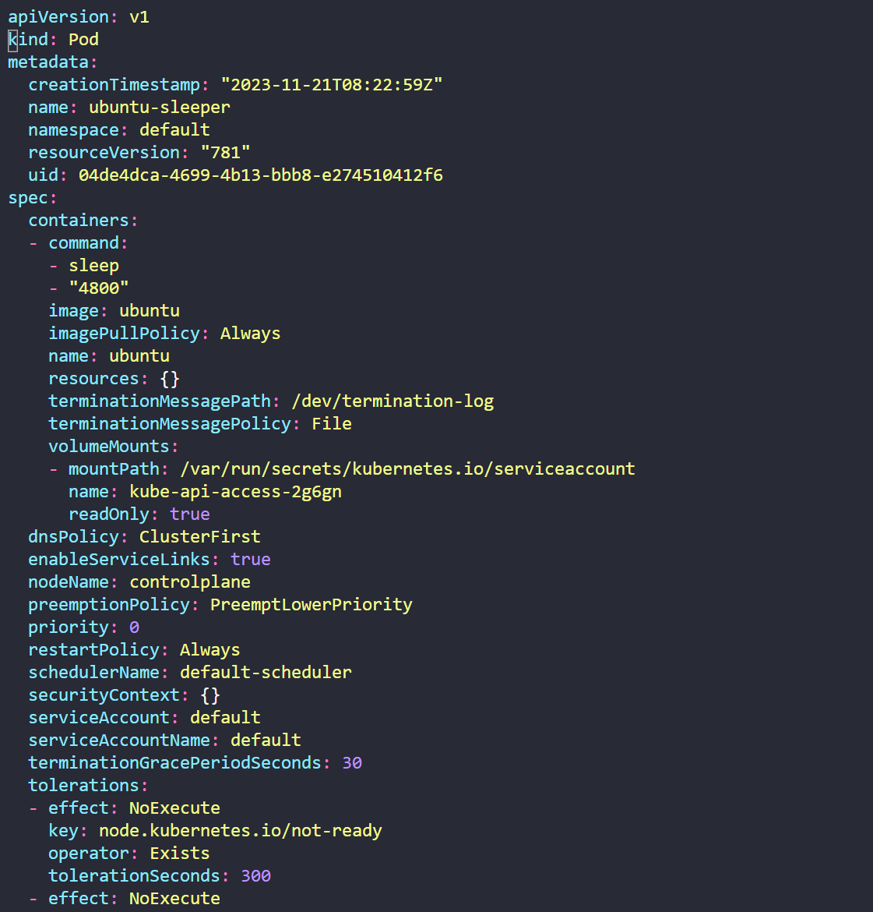
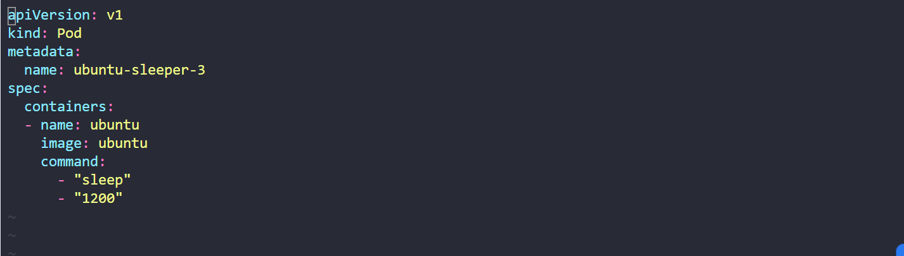
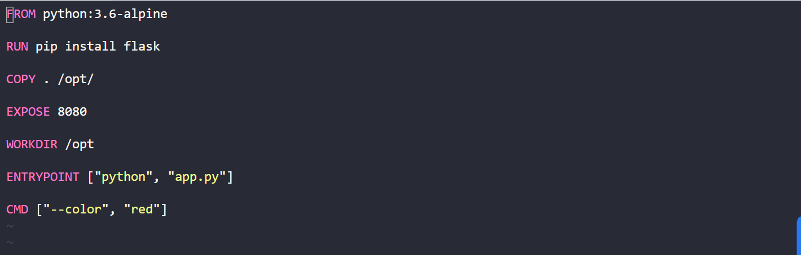
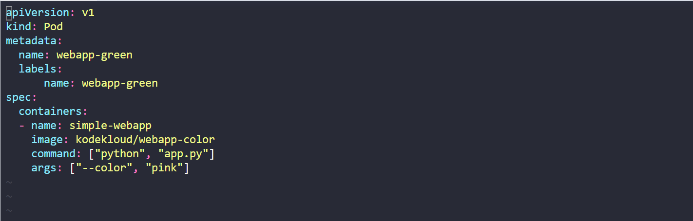
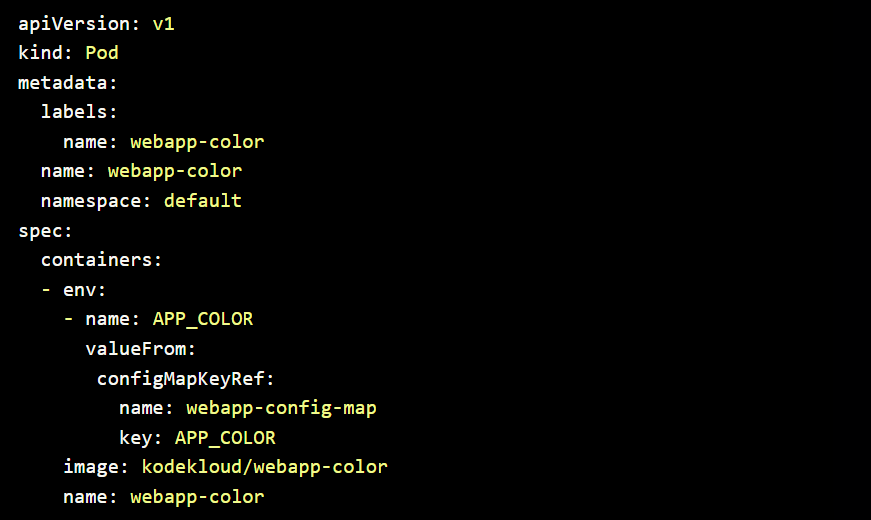

## Define, build and modify container images

1. Image 필요성

- Docker Hub에서 application의 일부로 사용하고자하는 구성 요소나 서비스를 찾을 수 없기 때문

- 개발 중인 application의 편리한 운송과 배포를 위해

- 본 section에서 application을 container화할 것 => `Flask` 프레임워크와 Python 사용하여 만든 웹 application

2. Image 생성 방법

- 어떤 application을 container화하는지, 어떤 application을 위한 image를 만드는지, application이 어떻게 build되는지 이해해야함

- application 수동 배포 단계

  - 1. Ubuntu와 같은 OS
  - 2. apt 명령어로 (source) repository 업데이트
  - 3. apt 명령어로 install dependency 설치
  - 4. pip 명령어로 Python dependency 설치
  - 5. application의 source code를 opt 폴더와 같은 위치에 복사
  - 6. flask 명령어로 웹 서버 실행

- 위의 설명은 원하는 Image를 만드는 process의 개요 역할

- local image 생성 단계
  - 1. `Dockerfile`이라는 이름의 Docker file 생성
  - 2. application에 설정할 instruction 작성: Ex. dependency, source code를 가져올 위치, application의 entrypoint 등
  - 3. Docker build 명령을 이용해 image build. 이때 Dockerfile과 image에 대한 tag 이름 명시 `docker build Dockerfile -t mmumshad/my-custom-app`
  - 4. public Docker Hub repository에서 사용 가능하도록 `docker push mmumshad/my-custom-app` 명령어 실행

`Dockerfile`

```
FROM Ubuntu

RUN apt-get update
RUN apt-get install python

RUN pip install flask
RUN pip install flask-mysql

COPY . /opt/source-code

ENTRYPOINT FLASK_APP=/opt/source-code/app.py flask run
```

3. Dockerfile

- 특정 형식으로 작성된 텍스트 파일

- `INSTRUCTION + ARGUMENT` 형식

  - `INSTRUCTION`은 Dockerfile에서 왼쪽에 대문자로 되어있고 각각의 INSTRUCTION은 Docker image를 만드는 동안 특정 동작을 수행하도록 함. EX. FROM, RUN, COPY, ENTRYPOINT
  - `ARGUMENT`는 INSTRUCTION에 대한 인자

- 위의 Dockerfile 설명
  - `FROM Ubuntu`는 container의 기본 OS 설치하는 명령어. 모든 docker image는 다른 image(OS 또는 OS에 근거해 만들어진 다른 image)에 근거해야함. Docker Hub에서 모든 OS의 공식 릴리즈 Image를 찾을 수 있음. 모든 Dockerfile은 반드시 INSTRUCTION에서부터 시작해야함
  - `RUN` INSTRUCTION를 통해 image에 설치되어야 할 dependency를 설치
  - `COPY` INSTRUCTION은 docker image에 local system에 있는 파일로부터 source code를 복사
  - `ENTRYPOINT` INSTRUCTION은 image가 container로 실행될 떄 실행되는 명령어

4. Layered architecture

`Dockerfile`

```
FROM Ubuntu
RUN apt-get update && apt-get -y install python
RUN pip install flask flask-mysql
COPY . /opt/source-code
ENTRYPOINT FLASK_APP=/opt/source-code/app.py flask run
```

- docker build 명령어로 build시 layered architecture 안에 build됨: `docker build Dockerfile -t mmumshad/my-custom-app`
- 각각의 INSTRUCTION이 docker image에 새로운 layer 생성. 이전 layer에서 변경된 것만
  - Layer1. Base Ubuntu OS Layer
  - Layer2. Changes in apt packages
  - Layer3. Changes in pip packages
  - Layer4. Source code
  - Layer5. Update Entrypoint with "flask" command
- 각 layer는 이전 layer의 변화만 저장하기 때문에 크기도 반영 : `docker history [IMAGE NAME]` 명령어로 크기 조회 가능

- docker build 명령을 실행하면 관련된 다양한 단계와 각 작업의 결과 조회 가능
- Layered architecture는 docker build가 실패하는 경우 특정 단계부터 다시 시작하도록 도우며 build process에 새로운 단계를 추가하는 경우 처음부터 다시 시작할 필요가 없음

- docker fail의 경우
  - Layer3가 실패하여 문제를 해결한 후 다시 docker build를 재실행하는 경우 또는 docker file에 layer를 추가하는 경우, 변화되지 않은 layer는 cache에서 이전 layer를 재사용
- image 재구축이 빠르며 docker가 매번 전체 image를 재구축하길 기다릴 필요 X
- application의 source code가 자주 변할 수 있기에 유용

5. containerize 가능 도구

- database, devops tool, OS 뿐 아니라 browser와 같은 간단한 것, curl과 같은 utility, Spotify 또는 Skype와 같은 application 컨테이너화 가능
- 모든 것이 container화가 가능하므로 설치가 아닌 docker를 사용해 실행

## Commands and Arguments in Docker

1. Docker container

- Docker container에 Ubuntu 실행 `docker run ubuntu`

  - `docker ps`로 실행 중인 container를 조회하면 아무것도 나오지 않음
  - `docker ps -a`로 전체 container 조회시 Exited STATUS로 나타남
  - VM과 달리 container는 OS를 호스팅하도록 되어 있지 않음. container는 특정 작업이나 process를 실행하도록 만들어지고 작업이 끝나면 container가 종료됨. ex. seb server, application server, database instance, 연산이나 분석 등
  - 따라서 container는 내부의 프로세스가 동작 중이어야 동작

- container 내에서 실행되는 프로세스 정의
  - 인기 Docker image인 `nginx`에 대한 Docker file에는 `CMD`라는 INSTRUCTION 존재 `CMD ["nginx"]`
  - `CMD`란 프로그램을 정의하는 명령의 약자로, 시작되면 container 내에서 실행될 명령
  - 위에서 진행한 작업은 ubuntu OS로 container를 실행하는 것. 해당 이미지에 대한 docker file에는 `CMD ["bash"]`
  - `BASH`는 web server나 database server와 같은 프로세스가 아니라 터미널에서 input을 듣는 shell. 터미널을 찾지 못하는 경우 Exit
  - Docker가 default로 실행 중일 때 container에 terminal을 연결하지 않음. 따라서 container에 terminal에 연결하지 않으므로 Bash 프로그램은 terminal을 찾지 못해 Exit

2. continaer run command 지정

- `docker run [IMAGE] [COMMAND]` Docker run command에 추가 옵션 추가 => 이미지에 지정된 기본 명령 재정의

  - `docker run ubuntu sleep 5`

- Docker file에 `CMD [COMMAND] [PARAMETER]` 영구적으로 지정
  - Docker file 재정의
  - `docker build -t ubuntu-sleeper .` 로 image build
  - `docker run ubuntu-sleeper`

```
FROM Ubuntu
CMD sleep 5     //or CMD ["sleep","5"]
```

- `docker run` 실행 시 sleep 시간을 지정하고 싶은 경우

  - 안 좋은 예시: Docker file은 `FROM Ubuntu CMD sleep 5`, `docker run ubuntu-sleeper sleep 10`
  - Docker file은 `FROM Ubuntu ENTRYPOINT ["sleep"]`, `docker run ubuntu-sleeper 10`
    - 위의 예시와 다르게 ENTRYPOINT를 sleep으로 두어 docker run 실행 시 sleep을 또다시 작성할 필요 X
    - 하지만 이 경우 docker run ubuntu-sleeper 만 실행하는 경우 오류 발생 => default 지정이 안되어있기 때문
  - Docker file은 `FROM Ubuntu ENTRYPOINT ["sleep"] CMD ["5"]`, `docker run ubuntu-sleeper`의 경우 sleep 5 동작, `docker run ubuntu-sleeper 10`의 경우 sleep 10 동작

- runtime 동안 ENTRYPOINT를 수정하고 싶은 경우, `docker run --entrypoint sleep2.0 ubuntu-sleeper 10`을 하는 경우, `ENTRYPOINT ["sleep2.0"]`으로 수정되고 10초동안 동작

- 즉, 기본적으로 5초동안 sleep 상태인 docker image 생성. docker run 명령어를 통해 sleep 시간 재정의 가능

## Commands and Arguments in Kubernetes

1. docker image

- 위에서 생성한 `ubuntu-sleeper` image로 pod 생성
- `docker run --name ubuntu-sleeper ubuntu-sleeper` or `docker run --name ubuntu-sleeper ubuntu-sleeper 10`

2. yml 파일 생성

- 기본 : `docker run --name ubuntu-sleeper ubuntu-sleeper`

`pod-definition.yml`

```
apiVersion: v1
kind: Pod
metadata:
    name: ubuntu-sleeper-pod
spec:
    containers:
        - name: ubuntu-sleeper
          image: ubuntu-sleeper
```

- argument 변경 시 yaml : `docker run --name ubuntu-sleeper ubuntu-sleeper 10`의 경우 pod

  - `docker run` 명령어에 추가된 내용은 pod 생성 시 모두 Pod Definition File의 spec에 들어감
  - `pod-definition.yml`의 spec>containers에 `args: ["10"]` 추가
  - pod에 지정된 args는 docker file의 CMD를 무효화

- ENTRYPOINT 변경 : `docker run --name ubuntu-sleeper --entrypoint sleep2.0 ubuntu-sleeper 10`의 경우 pod
  - `pod-definition.yml`의 spec>containers에 `command: ["sleep2.0"]` 추가
  - pod에 지정된 command는 docker file의 ENTRYPOINT를 무효화

`Dockerfile`

```
FROM ubuntu
ENTRYPOINT ["sleep"]
CMD ["5"]
```

`pod-definition.yml`

```
apiVersion: v1
kind: Pod
metadata:
    name: ubuntu-sleeper-pod
spec:
    containers:
        - name: ubuntu-sleeper
          image: ubuntu-sleeper
          command: ["sleep2.0"]
          args: ["10"]
```

|      Dockerfile      |         YAML          |
| :------------------: | :-------------------: |
| ENTRYPOINT ["sleep"] | command: ["sleep2.0"] |
|      CMD ["5"]       |     args: ["10"]      |

## A quick note on editing Pods and Deployments

1. Edit Pod

- Pod는 아래의 spec만을 편집할 수 있음

  - spec.containers[*].image
  - spec.initContainers[*].image
  - spec.activeDeadlineSeconds
  - spec.tolerations

- 이외의 running 상태인 pod의 environment variables, service accounts, resource limits를 수정할 수는 없지만 정말 원할 경우 가능한 두 가지 옵션 존재

2. 두 가지 옵션

- 1. `kubectl edit pod [POD NAME]` 명령어 실행해 vi 편집기에서 pod open. 원하는 spec 수정하고 저장 시 오류 발생 => 수정불가능한 편집기 사용했기 때문
  - 저장 시 오류가 발생하지만 temporary location에 수정한 파일의 복사본 저장
  - 기존의 pod 삭제 후 temporary location에 존재하는 file로 pod 생성
  - `kubectl delete pod webapp` > `kubectl create -f /tmp/kubectl-edit-ccvrq.yaml`



- 2. `kubectl get pod webapp -o yaml > my-new-pod.yaml` 명령어를 통해 pod definition file을 YAML로 추출
  - vi 편집기로 파일 변경 `vi my-new-pod.yaml`
  - 기존의 pod 삭제 후 변경한 파일로 pod 생성
  - `kubectl delete pod webapp` > `kubectl create -f my-new-pod.yaml`

3. Edit Deployment

- Deployments 사용해 pod의 field와 spec 쉽게 편집 가능
- pod는 deployment의 하위개념이므로 deployment 변경 시 자동으로 기존 pod는 삭제되고 새로운 pod 생성
- `kubectl edit deployment my-deployment`

## Environment Variables

1. Environment Variables

- `docker run -e APP_COLOR=pink simple-webapp-color`

- pod definition file
  - `env` property 사용. env는 array로, env 속성 하의 모든 항목은 배열 내의 항목을 나타내는 대시(-)부터 시작
  - env 하위의 name은 환경변수의 이름으로 container와 함께 사용 가능, value는 해당 환경변수의 값
  - 아래의 yaml 파일의 environment value는 `key-value` 포맷을 이용하여 환경변수 직접 지정

`pod-definition.yaml`
```
apiVersion: v1
kind: Pod
metadata:
  name: simple-webapp-color
spec:
  containers:
    - name: simple-webapp-color
      image: simple-webapp-color
      ports:
        - containerPort: 8080
      env:
        - name: APP_COLOR
          value: pink
```

2. ENV Value Type

- Plain Key Value
```
env:
  - name: APP_COLOR
    value: pink
```

- ConfigMaps
```
env:
  - name: APP_COLOR
    valueFrom:
      configMapKeyRef:
```
- Secrets
```
env:
  - name: APP_COLOR
    valueFrom:
      secretKeyRef:
```

- key-value와 configmap,secret의 차이점은 값을 지정하는 대신값을 지정하고 configmap이나 secret의 사양에 따른다는 점

## ConfigMaps

- 이전 강의에서 pod definition file에서 environment variable 정의하는 법 보여줌 => pod definition file이 많은 경우 Query file에 저장된 environment data를 관리하기 어려움

1. ConfigMap

- ConfigMap을 사용하면 pod definition file에서 environment variable 정보를 가져와 중앙에서 관리 가능

- ConfigMap은 Kubernetes의 key-value 쌍으로 configuration data를 전달하는데 사용
- pod가 생성되면 pod에 configmap을 삽입해 key-value 쌍이 environment value로 사용되어 pod의 container 안에서 host된 application program을 위해 동작

- 기존 pod-definition
`pod-definition.yaml`
```
...
spec:
  containers:
      ...
      env:
        - name: APP_COLOR
          value: blue
        - name: APP_MODE
          value: prod
```
- ConfigMap 사용
`ConfigMap`
```
APP_COLOR: blue
APP_MODE: prod
```
`pod-definition.yaml`
```
...
spec:
  containers:
      ...
      envFrom:
        - configMapRef:
            name: app-config
```

2. ConfigMap 구성

- STEP1: Create ConfigMap: Imperative
  - Imperative: `kubectl create configmap`. ConfigMap definition file 생성 X
  - 1. 명령어에서 `--from-literal`를 이용해 명령 자체에서 key-value 쌍 직접 지정
    - `kubectl create configmap [CONFIG-NAME] --from-literal=[KEY]=[VALUE]`
    - `kubectl create configmap app-config --from-literal=APP_COLOR=blue`
    - 둘 이상의 config를 지정하고 싶은 경우 `--from-literal` 옵션 여러 번 지정
  - 2. 명령어에서 `--from-file`을 이용해 파일을 통해 config data 지정
    - `kubectl create configmap [CONFIG-NAME] --from-file=[PATH-TO-FILE]`
    - `kubectl create configmap app-config --from-file=app_config.properties`

- STEP1: Create ConfigMap: Declarative
  - Declarative: `kubectl create -f`. ConfigMap definition file 생성
  - `config-map.yaml` 이름의 definition file 생성. Pod의 definition과 달리 `spec 대신 data` field 존재
    - data field 아래에 key-value 형식으로 config data 추가

  `config-map.yaml`  
  ```
  apiVersion: v1
  kind: ConfigMap
  metadata:
    name: app-config
  data:
    APP_COLOR: blue
    APP_MODE: prod
  ```

  - configmap은 나중에 pod와 관련해 사용하기에 이름을 적절히 붙여줘야함

  `app-config`
  ```
  APP_COLOR: blue
  APP_MODE: prod
  ```
  `mysql-config`
  ```
  port: 3306
  max_allowed_packet: 128M
  ```
  `redis-config`
  ```
  port: 6379
  rdb-compression: yes
  ```

- STEP2: Inject into Pod
  - 1. `ENV` : Pod definition file에 `envFrom` property 추가
  - `envFrom`은 리스트 형태로, 필요한 만큼 environment variable을 넘길 수 있으며 list의 각 항목은 configmap과 일치
  
  `pod-definition.yaml`
  ```
  apiVersion: v1
  kind: Pod
  metadata:
    name: simple-webapp-color
    labels:
      name: simple-webapp-color
  spec:
    containers:
      - name: simple-webapp-color
        image: simple-webapp-color
        ports:
          - containerPort: 8080
        envFrom:
          - configMapRef:
              name: config-map  //configmap 이름
  ```
  - `kubectl create -f pod-definition.yaml`을 통해 configmap에 나타난 blue 배경으로 만들어진 웹 프로그램 생성
  - 2. `SINGLE ENV`: 단일 환경 변수
  ```
  env:
    - name: APP_COLOR
      valueFrom:
        configMapKeyRef:
          name: app-config
          key: APP_COLOR
  ```
  - 3. `VOLUME`: 전체 데이터를 파일로 volume에 넣을 수 있음
  ```
  volumes:
    - name: app-config-volume
      configMap:
        name: app-config
  ```
  
3. 명령어

- `kubectl get configmaps` : configmap 조회
- `kubectl describe configmaps`: config data를 data 섹션 아래에 나열


## Labs 실습

1. Docker Image

Q?. image를 run할 때에는 Dockerfile에 정의된 ENTRYPOINT에 맞게 접근해야함
Q8

- `cd` 명령어를 통해 디렉토리 이동 & `pwd` 명령어로 현재 위치 확인
- Docker file을 통해 `webapp-color` 이름을 가지는 docker image 생성 => `docker build -t webapp-color .` : `.`은 코드 전체를 의미
  Q9. image를 실행하면서 container port 8080 port와 host port 8282 매핑
- `docker run -p 8282:8080 webapp-color`
- CTRL + C 로 중지 가능
  Q11. image의 base OS 확인
- `docker run python:3.6 cat /etc/*release*`
  Q14.
- base OS로 `python:3.6` 대신 `python:3.6-alpine` 사용
- alpine이란 가장 작은 사이즈로 정말 필요한 것들만 담겨져 있는 image

2. Commands and Arguments

Q2. What is the command used to run the pod ubuntu-sleeper?

- `kubectl get pod [POD NAME] -o yaml > [YAML NAME].yaml`로 pod에 따른 YAML 파일 생성 후 vi 편집기로 확인
  

- Solution: `k describe [POD NAME]`으로 확인 가능

Q3. Create a pod with the ubuntu image to run a container to sleep for 5000 seconds. Modify the file ubuntu-sleeper-2.yaml

- command 하는 법
  - 1. []로 묶기. 이떄 command와 argument는 분리되어야함. 많이 사용하지 않는듯 
  `command: ["sleep","5000"]`
  - 2. command에서 -로 분리. 3의 간소화 형식
  ```
  command:
    - "sleep"
    - "5000"
  ```
  - 3. command와 argument 각각 정의. 기본
  ```
  command: ["sleep"]
  args: ["5000"]
  ```

Q4. Create a pod using the file named ubuntu-sleeper-3.yaml. There is something wrong with it. Try to fix it!

- 아래와 같이 command의 child로 한 번에 정의 가능



- Solution: `kubectl create` 명령어를 통해 생성해보고 오류메세지를 통해 유추

Q5. Update pod ubuntu-sleeper-3 to sleep for 2000 seconds.

- Solution: `kubectl edit pod [POD NAME]`으로 pod 수정 > 수정할 수 없다는 오류가 발생하고 "/tmp/kubectl-edit-2693604347.yaml"에 수정본 copy > `kubectl replace --force -f /tmp/kubectl-edit-2693604347.yaml`로 기존 pod 삭제 후 해당 파일로 새로운 pod 생성

Q8. Inspect the two files under directory webapp-color-2. What command is run at container startup? Assume the image was created from the Dockerfile in this directory.

- container 시작 시 yaml 파일에 지정된 command가 dockerfile을 무효화시키므로, yaml 파일을 확인해야함
- yaml 파일에 command의 parameter가 모두 재정의되었으므로 해당 command를 명령어로 실행

- Solution: `cat webapp-color-2/Dockerfile2`와 `cat webapp-color-2/webapp-color-pod.yaml`로 dockerfile과 yaml file 비교. yaml 파일에 재정의된 명령만 command로 실행되므로 `--color green`

Q9. What command is run at container startup?

- YAML파일에서 존재하는 모든 command와 argument 실행해야함




Q10. Create a pod with the given specifications. By default it displays a blue backgroud. Set the given command line arguments to change it to green.

- Solution: `kubectl run nginx --image=nginx -- <arg1> <arg2> ... <argN>` 사용해 argument 지정 가능 => `kubectl run webapp-green --image=kodekloud/webapp-color -- --color green`

3. ConfigMaps

Q10. 다시해보기

