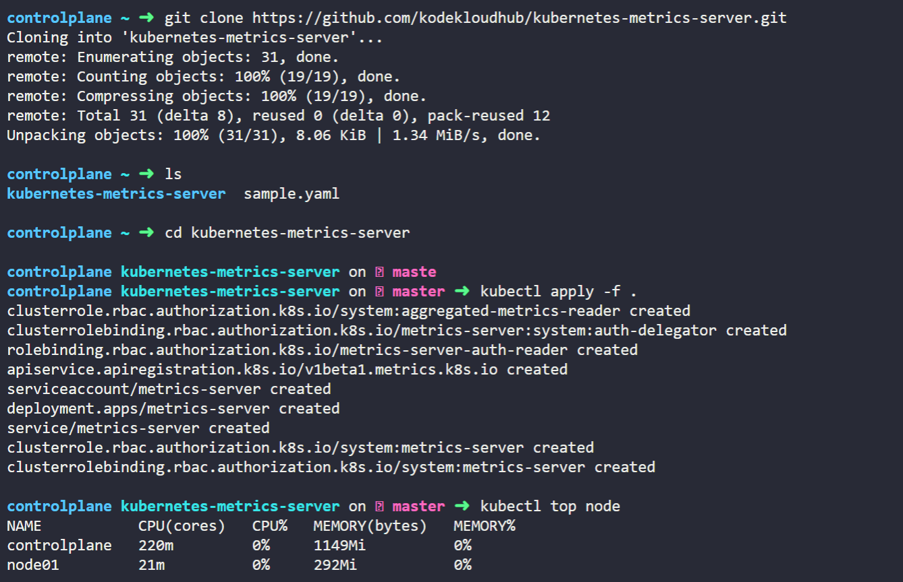

## Readiness and Liveness Probes

0. Probe

- Container에서 kubelet에 의해 주기적으로 수행되는 진단. Probe를 통해 Kubernetes는 각 `container의 상태를 주기적으로 체크`한 후 `문제가 있는 container를 자동으로 재시작하`거나 문제가 있는 container를 `서비스에서 제외`할 수 있음

- Probe의 종류
    - `Liveness probe` : application의 상태를 체크해 서버가 제대로 응답하는지 혹은 container가 제대로 동작중인지 검사
    - `Readiness probe` : container가 요청을 처리할 준비가 되었는지 확인하는 probe. pod가 새로 배포되고 Running 상태여도 `처음에 로딩하는 시간`이 있기 때문에 이 시간동안 application에 접속하려고 하면 오류 발생 
        - cf. Liveness 와 Readiness: Liveness Probe는 핸들러 조건 아래 fail이 나면 pod를 재실행하지만, Readiness는 pod를 서비스로부터 제외시킴

    - `Startup probe` : container 내의 application이 시작되었는지 나타냄. startup probe가 주어진 경우 성공할 때까지 다른 prob는 활성화되지 않으며 만약 startup probe가 실패하면 kubelet이 container를 죽이고 container는 restart policy에 따라 처리

1. Pod의 Status

- Pod는 Status와 Conditions 존재
- `Pod Status`를 보면 lifecycle에서의 현재 위치를 알 수 있음 `kubectl get pods`의 STATUS
    - `Pending` : pod가 처음 생성될 때의 상태. scheduler는 이 시점에 pod를 어디에 둘지 고민. scheduler가 pod를 설치할 node를 찾지 못하면 계속 pending 상태
    - `ContainerCreating` : node가 지정되면 pod는 container로 가서 application에 필요한 이미지를 끌어오고 containerCreating 상태로 변환
    - `Running` : pod에 있는 container가 모두 동작하기 시작하면 프로그램이 성공적으로 끝나거나 종료될 때까지 Running 상태

2. Pod의 Conditions
- `Pod Conditions` : STATUS 이외의 추가 정보 필요. True 또는 False의 배열로 pod의 status 나타냄 `kubectl describe pod [POD NAME]`의 CONDITIONS
    - `PodScheduled` : pod가 node에 지정되면 True
    - `Initialized` : pod가 초기화되면 True
    - `ContainersReady` : pod에 있는 모든 container가 준비되면 True
    - `Ready` : pod 내에서 application이 실행 중이며 사용자 트래픽을 받아들일 준비가 되었을 경우 True  `kubectl get pods`의 READY
        
- pod를 초기화하고 warmup되어 사용자를 처리할 준비가 필요한데, warmup이 완료되지 않은 경우에도 `k get pods`하는 경우 Ready 상태가 나타나는데 이는 사실이 아님
    - 잘못 표시되는 것이 문제인 이유
    - Scenario: Pod를 만들어 서비스를 이용해 외부 사용자에게 노출>traffic이 pod로 즉시 이동>pod의 READY condition에 따라 서비스가 달라짐. 기본적으로 Kubernetes는 container가 생성되자마자 사용자 traffic을 처리할 준비가 되었다고 생각해 각 container의 값을 true로 설정>하지만 container 내의 application이 준비되는데 오래 걸리면 서비스는 이를 모르고 container가 이미 준비된 상태로 traffic 전송>사용자는 application이 실행되지 않은 pod에 들어감
    - READY condition을 container 내의 application의 실제 status에 연결해야함

3. Readiness Probes

- container 내의 application이 실제로 준비되면 정의할 수 있는 방법

- 1. `HTTP Test - /api/ready` : `웹`의 경우 API server로 HTTP Test 실행
    - port와 ready API 지정
    - container가 생성되면 Kubernetes는 container의 Ready Condition을 True로 설정하지 않고 API가 긍정적으로 반응하는지 검사. 긍정적 반응이 오기 전까지 pod가 준비되지 않은 것으로 간주해 pod로 어떤 traffic도 전달하지 않음
`pod-definition.yaml`
```
apiVersion: v1
kind: Pod
metadata:
    name: simple-webapp
spec:
    containers:
        - name: simple-webapp
          image: simple-webapp
          ports:
            - containerPort: 8080
          #아래 코드 추가
          readinessProbe:
            httpGet:
                path: /api/ready
                port: 8080
            initialDelaySeconds: 10
            periodSeconds: 5
            failureThreshold: 8
```
- 2. `TCP Test - 3306` : `database`의 경우 특정 TCP 소켓이 listening 상태인지 테스트
    - port 지정
```
readinessProbe:
    tcpSocket:
        port: 3306
```
- 3. `Exec Command` : 단순히 container 내에서 명령 실행해 application이 준비되면 성공적으로 나가는 custom script 실행
```
readinessProbe:
    exec:
        command:
            - cat
            - /app/is_ready
```

- 4. 추가 옵션
    - application이 warmup되는데 최소 필요한 시간 지정 가능 `initialDelaySeconds: 10`
    - probe 횟수 지정 가능 `periodSeconds: 5`
    - 기본적으로 probe 3번 실패 시 probe 중단. 더 시도하고 싶은 경우 threshold 지정 `failureThreshold: 8`

- 5. Multiple-Pod에서 Probe 사용
    - Multiple pod(2개)를 가진 replicaset 또는 deployment가 존재한다고 가정: 서비스가 모든 pod에 traffic 전달.2개의 pod는 이미 사용자를 받고 있음>pod를 하나 더 추가해 warmup하는데 1분이 걸린다고 가정>readiness probe 설정이 제대로 안 되면 서비스는 즉시 새 pod로 traffic 전달 => 일부 사용자에 한하여 서비스의 혼란 야기 가능성 발생
    - readiness probe가 올바르게 설정된 경우 container 내의 application이 정상적으로 동작할 때부터 traffic을 받아 서비스의 혼란이 없음

## Liveness Probes

1. `Docker`를 이용해 nginx 이미지를 실행(`docker run nginx`)하면 사용자를 돕기 시작>웹서버,nginx 프로세스,container 중단> `docker ps -a` 명령으로 container 상태 조회 가능. docker는 orchestration engine이 아니기 때문에 사용자가 수동으로 새 container 만들 기 전까지 container는 계속 죽어 사용자의 서비스 거부 

2. `Kubernetes`를 이용해 web application 실행(`kubectl run nginx --image=nginx`)>applicaton이 down될 때마다 Kubernetes는 container를 재시작해 사용자의 서비스를 복구하려함. 이때마다 RESTARTS 수 증가

3. But `application은 작동하지 않고 container는 살아있는 경우`는 ?
    - Ex. 코드에 버그가 있어 applicatoin이 무한 루프에 갇혀있음
    - Kubernetes의 경우 container가 올라가 있으니 application도 올라간 것으로 추정되지만 사용자는 사용할 수 없음
    - 이 경우 container를 재가동하거나 파괴하고 새로운 container를 가져와야함 => `Liveness Probe` 등장

4. Liveness Probe는 container에서 정기적으로 구성되어 container 내의 application이 정상인지 테스트 가능
    - Fail의 경우 container가 unhealthy하다고 간주해 파괴하고 재생성

5. Healthy Application
    - 1. 웹 어플리케이션의 경우, `HTTP Test - /api/healthy` 
        - api 서버가 정상적으로 실행될 때
        ```
        livenessProbe:
            httpGet:
                path: /api/healthy
                port: 8080
            initialDelaySeconds: 10
            periodSeconds: 5
            failureThreshold: 8
        ```
    - 2. 데이터베이스의 경우, `TCP Test - 3306`
        - 특정 TCP socket이 listening 상태인지 테스트
        ```
        livenessProbe:
            tcpSocket: 
                port: 3306
        ```
    - 3. 테스트를 실행하기 위해 명령 실행 `Exec Command`
        ```
        livenessProbe:
            exec:
                command:
                    - cat
                    - /app/is_healthy
        ```

6. Liveness Probe는 Readiness Probe와 코드 및 옵션이 비슷

## Container Logging

1. Logs - Docker

- `docker run kodekloud/event-simulator`: web server simulator로 random event 생성
- 이 이벤트는 application에 의한 표준 결과인 Log 출력
- 백그라운드로 실행하는 경우 `-d` 옵션 사용하면 Log 보이지 않음 `docker run -d kodekloud/event-simulator`
- `docker logs` command 사용해 log 조회 가능. container Id를 사용할 수도 있고, `-f` 옵션 사용해 log trail 조회 가능

2. Logs - Kubernetes

- definition file을 이용해 동일한 Docker image의 pod 생성 
    - `kubectl create -f event-simulator.yaml`
`event-simulator.yaml`
```
apiVersion: v1
kind: Pod
metadata:
    name: event-simulator-pod
spec:
    containers:
        - name: event-simulator
          image: kodekloud/event-simulator
```
- `kubectl logs -f [POD NAME]`으로 pod name을 이용해 log streaming 가능
    - 해당 log는 pod 내부의 container에 관한 log
    - Kubernetes pod는 여러 개의 docker container를 담을 수 있음 => `pod definition file 수정`: image-processor라는 추가 container 포함

- image-processor 추가 
    - `kubectl logs -f [POD NAME] [CONTAINER NAME]`으로 해당 pod의 특정 container의 log 조회 가능
    - 아래 파일을 사용하면 `kubectl logs -f event-simulator-pod event-simulator`
    - 위 명령어에 container name 지정하지 않으면 지정하라는 메세지 출력

`event-simulator.yaml`
```
apiVersion: v1
kind: Pod
metadata:
    name: event-simulator-pod
spec:
    containers:
        - name: event-simulator
        image: kodekloud/event-simulator
        #아래 container 추가 !
        - name: image-processor
          image: some-image-processor
```


## Monitor and Debug Applications

1. Monitoring

- Node level metric 필요 (Cluster 내 node 수 / 정상 개수 성능 지표 / CPU, memory, 네트워크 디스크 활용) / 포드 레벨 지표 필요(포드 개수, 각 포드 성능 지표, CPU와 memory 소모량)

- 이런 metric을 monitoring하고 저장하고 데이터에 대한 분석을 제공할 수 있는 솔루션 필요
- Kubernetes는 모든 기능이 탑재된 모니터링 솔루션 X. But `Opensource solution` 존재 
    - Ex. Metrics Server, Prometheus, Elastic Stack, Datadog, dynatrace
    - CKAD에서는 모니터링의 기본만 알면 되므로 `Metrics Server`만을 사용

2. Heapster vs Metrics Server

- Heapster는 초기 프로젝트 중 하나로 Kubernetes의 모니터링과 분석 기능을 가능하게 함
- But Heapster는 이제 사라지고 Metrics Server라는 슬림한 버전 등장

3. Metrics Server

- Kubernetes cluster 당 metric server 1개
- Metrics Server는 Kubernetes node와 pod에서 metric 회수해 모아 메모리에 저장
- Metrics Server는 In-Monitoring 솔루션이고 디스크에 metric을 저장하지 않음 => 따라서 performance history는 볼 수 없으며 이를 위해서 고급 모니터링 솔루션 사용해야함
- Node의 Pod에 대한 metric 생성법
    - Kubernetes는 `Kubelet`라는 agent를 각 node에 실행. kubelet은 Kubernetes의 API master server로부터 지시를 받고 node의 pod를 실행하는 역할
    - kubelet은 cAdvisor(=container Advisor)라 불리는 하위 요소 포함. cAdvisor는 pod에서 performance metric을 회수하고 kubelet API를 통해 metric을 공개해 metric server에서 metric을 사용할 수 있게 함

4. Metrics Server

- Minikube `minikube addons enable metrics-server`
- Others `git clone https://github.com/kubernetes-in` 
    - 레포지토리에서 metric server 배포 파일을 복제하여 Metric Server 배포
    - 이후 `kubectl create -f deploy/1.8+/`로 필수 구성요소 배포
- 위 명령어로 pod, service, role 세트를 배포해 metric server 활성화 + 클러스터 내 노드에서 performance metric을 위한 설문조사 가능
- metric server가 데이터를 수집하고 처리할 시간 필요. 일단 처리되면 클러스터 성능은 `kubectl top node` 상단에서 확인 가능 => 각 노드의 CPU와 메모리 개념 제공
- `kubectl top pod` 명령을 통해 kubernetes 내 pod 성능 지표 확인 가능

## Labs 실습

1. Readiness and Liveness Probes

Q3. 

- `/root/curl-test.sh` script를 실행시키기 위해 `./curl-test.sh` 명령어 실행 => Readiness Probes 확인

- Sol: web application에 접근 요청을 보내는 test script가 주어짐

Q4.

- Sol: 새로운 pod가 생성되어 동일한 scipt를 실행했을 때 변화가 있음 => webapp-1은 항상 성공하지만 webapp-2는 실패. 준비가 되어있지 않으면 (traffic) 요청을 보내지 않도록하는 `webapp-2를 위한 readiness probe 필요`

Q7.

- Sol: webapp-2의 readiness probe 설정 후 다시 `curl-test.sh`를 실행해 모든 요청이 정상적으로 진행됨을 알 수 있음. 모두 webapp-1으로 요청. 아직 webapp-2가 준비되지 않았기 때문

Q9.

- Sol: `pod를 crash`. `./crash-app.sh`하면 webapp-2가 crash Message from simple-webapp-2: Mayday! Mayday! Going to crash! 출력. `./curl-test.sh`하면 webapp-1에만 요청. 따라서 pod가 crash되면 pod를 재생성

Q10.

- Sol: `pod를 freeze`. `./freeze-app.sh` 명령어로 pod(webapp-2) 하나 freeze. pod를 얼릴 경우 새로운 사용자가 영향을 받음 

Q13.

- Sol: 앞 문제에서 pod의 readiness, liveness 모두 추가한 후 `./freeze-app.sh`로 pod를 freeze 시켜도 liveness에 의해 재시작되어 `./curl-test.sh`하면 Fail 없이 모두 정상적으로 동작

2. Container Logging

Q2. 

- `kubectl logs -f [POD NAME]`으로 실시간 로그 확인
- Sol: `kubectl logs [POD NAME]`

Q4.

- Sol: `kubectl logs webapp-2`하면 error:a container name must be specified for pod webapp-2, choose one of: [simple-webapp db] 출력. container가 2개 이상이라 하나를 선택하라는 뜻 => `kubectl logs webapp-2 simple-webapp`

3. Monitoring

Q2. 

- `git clone`한 후 `cd kubernetes-metrics-server`로 폴더 안에 접근> `kubectl create -f .`로 Metric Server 배포에 필요한 모든 객체 생성

