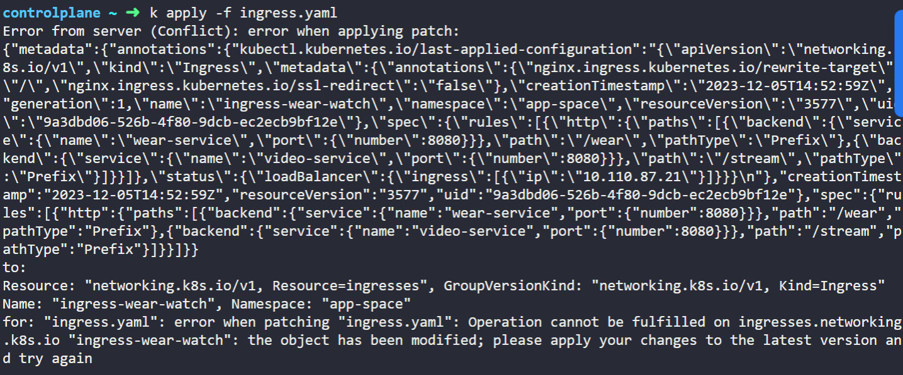

## Services

1. Service

- application 안밖의 다양한 `구성요소 간의 통신`을 가능하도록 함
- application을 다른 application 또는 사용자와 연결하는데 도움을 줌
- pod group 간의 연결을 가능하게 함
    - application엔 다양한 섹션을 실행하는 pod group 존재 
    - 프론트엔드 처리하는 그룹,백엔드 프로세스를 실행하는 또다른 그룹 등
    - 외부 데이터 소스에 연결된 third group 존재
- Service는 프론트엔드 applicatoin을 사용자가 사용할 수 있도록 하며, 프론트엔드와 백엔드 pod 간의 통신을 돕고 외부 데이터 소스와의 연결을 구축하는데 도움을 줌


2. Service 등장

- 지금까지 내부 네트워크를 통해 pod가 서로 소통하는 법을 이야기 함
- Service를 사용하면 외부 통신 가능
- 기존 Setup
    - Kubernetes node의 IP 주소는 `192.168.1.2`. 노트북도 같은 network에 존재하며 IP 주소는 `192.168.1.10`
    - 내부 pod의 network는 `10.244.0.0` 범위 내에 존재하고 pod는 IP 주소가 `10.244.0.2`
    - 이 경우 User는 `분리된 network`에 존재하기에 10.244.0.2의 pod에 접근할 수 없음
    - 접근 방법
        - `curl http://10.244.0.2`로 SSH 접근
        - or 노드에 GUI가 있다면 브라우저를 실행해 웹페이지 접근 가능
- Node에 SSH를 사용하지 않고 node의 IP를 액세스함으로써 노트북에서 웹 서버에 접근하길 원함 => `Service`

3. Service Types
- NodePort
    - Service가 node의 port에 내부 pod port를 access
- ClusterIP
    - Service는 내부에 가상 IP를 만들어 frontend server set와 backend server set 같은 다양한 service 간의 통신을 가능하게 함
- LoadBalancer
    - 지원되는 cloud provider에서 우리 application을 provision
    - ex. frontend 계층의 다양한 web server에 load 배포

## Services - NodePort

1. NodePort
- 3개의 port 존재
    - `targetPort`: 실제 web server가 실행 중인 pod의 port. 서비스가 요청을 전달하는 객체의 port. 할당하지 않는 경우 port와 동일하게 인식
    - `port`: service의 port. service는 node 안의 가상 server와 같음. cluster 내부에 고유한 IP 주소(=service cluster IP) 존재
    - `nodePort`: Node에 존재하는 port. 외부 웹 서버에 액세스할 때 사용하며 유효 범위(30,000~32,767)에만 존재. 할당하지 않은 경우 유효 범위 내에서 자동으로 할당

2. service definition file
    - Service의 spec에는 다른 object와 달리 `type`과 `ports` 섹션 존재. 다른 object와 비슷하게 `selector` 존재
        - type은 service의 type
        - ports는 배열이므로 - 필요. 하위 섹션으로 targetPort, port, (nodePort인 경우)nodePort 존재
        - selector로 service와 원하는 pod 매핑
`service-definition.yml`
```
apiVersion: v1
kind: Service
metadata:
    name: myapp-service
spec:
    type: NodePort
    ports:
        - targetPort: 80    
          port: 80
          nodePort: 30008
    selector:
        app: myapp
        type: front-end
```

3. kubectl 명령어
- `kubectl create -f service-definition.yml`
- `kubectl get services`
    - TYPE에는 service type, PORT(S)에는 port 나타남
    - nodePort service의 경우 PORT(S)가 [port]/[nodePort]
- `curl http://192.168.1.2:30008`
    - `curl [nodeIP]:[nodePort]` 하면 nodePort를 이용해 웹 서버 액세스 가능

4. 다양한 Case
- **Pod가 여러 개인 경우** service의 selector가 label을 가리키기에 여러 pod 접근 가능

> 여러 pod에 부하 분산을 위해 어떤 알고리즘을 쓰는지 궁금하다면 `Random SessionAffinity` 사용

- **다중 Node에 pod가 분산된 경우** cluster 내의 개별 node pod에 application 존재. service를 생성할 때 kubernetes는 자동으로 모든 node를 가로질러 cluster 내의 모든 node에 같은 node 매핑. cluster에 있는 nodeIp와 같은 port 번호를 사용해 해결 가능. 이 경우엔 30008

- 요약하면 service는 어떤 상황이든 똑같이 생성. pod가 제거되거나 추가되어도 service는 자동으로 업데이트되어 유연하고 적응적 

## Services - ClusterIP

1. ClusterIP

- Service의 기본 Type
- application의 서비스나 계층 간의 연결을 확립하는 방법
- pod는 모두 IP 주소가 할당되어 있지만 고정적이지 않아 application 간의 내부 통신을 IP 주소에만 의존할 수 없음
- Service를 통해 pod를 하나로 묶고 하나의 인터페이스를 통해 단체 pod에 접속
    - Ex. front-end pod 3개, back-end pod 3개, redis DB pod 3개 존재하는 경우
    - back-end pod를 위해 만든 Service는 모든 back-end pod를 하나로 묶어 다른 pod가 이 service에 접근할 수 있는 단일 인터페이스 제공하며, request는 무작위로 하나의 pod로 전달
- 각 `Service는 IP`를 갖고 클러스터 내부에 할당 => 다른 pod가 service에 접근하는데 service 이름 사용

2. ClusterIP Service 생성

- yaml 파일 생성 > `kubectl create -f service-definition.yaml`
`service-definition.yaml`
```
apiVersion: v1
kind: Service
metadata:
    name: back-end
spec:
    type: ClusterIP
    ports:
      - targetPort: 80  #pod의 port. back-end pod가 노출된 port
        port: 80        #service의 port. service가 노출된 port
    selector:
      app: myapp
      type: back-end
```

## Ingress Networking

1. 예시 application

- 1. On-premise 
- application을 실행할 Pod , 데이터베이스인 MySQL Pod와 둘을 잇는 ClusterIP Service, application을 외부에서 접근 가능하도록 하는 NodePort Service(wear-service) 
    - 위의 경우, nodePort가 38080이라 가정하면 URL을 통해 `http://[Node-IP]:38080` application 접근 가능
    - traffic이 증가하면 pod 수를 늘려 처리 
- `DNS 서버`를 구성해 node의 ip 주소를 가리키도록 함
    - `http://my-online.com:38080`으로 접근 가능
- DNS 서버와 클러스터 사이에 추가 layer로 `proxy server` 추가
    - port 80에서 38080을 프록시 요청
    - `http://my-online.com`으로 접근 가능

- 2. public cloud 환경(ex.Google Cloud Platform)으로 변경
- NodePort 형식의 Service를 만드는 대신 `LoadBalancer`로 설정 가능
    - case1. 쿠버네티스는 NodePort에 대해 해야하는 모든 작업을 함
    - case2. 쿠버네티스는 GCP(Google Cloud Platform)에 요청 보냄
        - "Service를 위한 네트워크 Loadbalancer를 provision 해줘"
        - 요청받은 GCP는 `gcp load-balancer` 배포해 트래픽 관리 후 쿠버네티스에 정보 전달 
        - load balancer는 외부 IP를 가지고 있어 사용자가 aplication에 접근하도록 제공
        - `http://my-online-store.com`d으로 접근 가능

- 3. 새 application 배포
- 새로운 application을 생성하지만 클러스터 리소스 공유를 위해서는 새 cluster 내의 별도의 배포를 해야함
- 이전에 배포한 것은 LoadBalancer 타입의 wear-service, 현재 배포하는 서비스는 LoadBalancer 타입의 video-service로 서비스별로 gcp load-balancer가 각각 38080, 38282로 할당

- 4. 두 load-balancer 사이의 Traffic 관리
- URL 기반 Traffic을 서로 다른 Service로 redirect할 수 있는 proxy 또는 loadBalancer 필요 
    - 새 Service가 추가될 때마다 load-balancer 재구성
    - `/apparel`은 gcp load-balancer, `/video`는 gcp load-balancer-2

- 5. SSL 활성화
- 사용자가 https를 이용해 application에 접근 가능
- `https://my-online-store.com`에서 접근 가능

2. Ingress

1. Ingress
- 사용자가 외부적으로 접근가능한 단일 URL을 이용해 application에 접근하도록 도움
- URL 경로에 기반해 클러스터 내 다양한 서비스로 `traffic routing`을 구성할 수 있으며 `SSL 보안 구현`
- Ingress는 쿠버네티스 클러스터에 내장된 LoadBalancer로, 위에서 설명한 `load-balancer`, 여러 서비스가 있는 경우 여러 load-balencer를 관리하는 `또다른 load-balancer`, `SSL 기능`까지 가능
    - Kubernetes 요소를 이용해 설정

- Ingress를 사용하는 경우의 application 접근
    - 외부(클러스터 밖)에서 접근하려면 Ingress를 써는 경우에도 동일하게 노출시켜야함
    - (1) NodePort로 게시
    - (2) 클라우드 기본 LoadBalancer로 게시
    
2. Ingress 구성

- 1. `Deploy`: 지원되는 역 proxy 또는 LoadBalancing Solution 배포
    - `Ingress Controller`
    - ex. NGINX, HARPROXY, TRAFIK, CONTOUR, ISTIO, GCP HTTP(S)&LOAD BALANCER(GCE)
    - Kubernetes Cluster는 기본값으로 Ingress Controller를 가지지 않음    

- 2. `Configure`: 다른 서비스로의 traffic routing에 사용하도록 구성
    - `Ingress Resources`
    - Ingress 구성을 위한 규칙 모음을 definition file로 명시
    - URL 루트 정의하고 SSL 인증서 구성

3. Ingress 구성 순서

- 1. Ingress Controller 배포
    - 위의 Ingress Controller 예시 중 GCE와 NGINX는 쿠버네티스에 의해 지원되고 관리되며 이번 강의에서는 NGINX 사용
    - `Ingress Controller`에서의 NGINX는 단순한 loadbalancer 또는 nginx 서버가 아니기에 추가적인 정보 제공하며 쿠버네티스에 배치된 또 다른 배포 수단으로 `definition file을 이용해 배포`
    - nginx는 구성 옵션(ex.err-log-path,keep-alive,ssl-protocols) 존재하는데 이를 image에서 분리하기 위해서는 별도의 `ConfigMap` object를 생성해 전달하며 `이 시점에서는 엔트리가 필요하지 않음`
    - 외부에서 접근할 NodePort 타입의 `Service` 필요
    - 올바른 권한을 가진 `ServiceAccount` 필요 : Roles, RoleBindings
    - 요약하면 `NGINX Ingress Controller` 배포 + nginx 구성 데이터를 알리는 `ConfigMap`, `Service`, `ServiceAccount`, 

`ingress-controller.yaml`
```
apiVersion: networking.k8s.io/v1
kind: Deployment
metadata:
    name: nginx-ingress-controller
spec:
    replicas: 1
    selector:
        matchLabels:
            name: nginx-ingress
    template:
        metadata:
            labels:
                name: nginx-ingress
        spec:
            containers:
                - name: nginx-ingress-controller
                  image: quay.io/kubernetes-ingress-controller/nginx-ingress-controller:0.21.0
                  args:
                    - /nginx-ingress-controller
                    - --configmap=${POD_NAMESPACE}/nginx-configuration
                  #pod 이름과 배포될 namespace 운반.nginx 서비스에서 요구하는 건 pod 내에서 configuration을 읽는 것
                  env:
                    - name: POD_NAME
                      valueFrom:
                        fieldRef:
                            fieldPath: metadata.name
                    - name: POD_NAMESPACE
                      valueFrom:
                        fieldRef:
                            fieldPath: metadata.namespace
                  #ingress controller가 사용하는 포트 지정
                  ports:
                    - name: http
                      containerPort: 80
                    - name: https
                      containerPort: 443
```

`nginx-configmap.yaml`
```
kind: ConfigMap
apiVersion: v1
metadata:
    name: nginx-configuration
```

`nginx-service.yaml`
```
apiVersion: v1
kind: Service
metadata:
    name: nginx-ingress
spec:
    type: NodePort
    ports:
        - port: 80
          targetPort: 80
          protocol: TCP
          name: http
        - port: 443
          targetPort: 443
          protocol: TCP
          name: https
    selector:
        name: nginx-ingress
```

`serviceaccount.yaml`
```
apiVersion: v1
kind: ServiceAccount
metadata:
    name: nginx-ingress-serviceaccount
```

- 2. Ingress resource
    - Ingress resource는 구성 규칙(Configuration Rule)의 집합으로, Ingress Controller에 적용
    - Kubernetes definition file로 정의
    - ex1. configuration rule로 모든 수신 트래픽을 하나의 application으로 전송 
        - 모든 서비스가 wear-service로 전달
    - ex2. URL에 기반해 여러 application routing
        - 사용자가 www.my-online-store.com에 가면 하나의 application으로 routing
        - `/watch` URL을 방문하면 video application으로 routing
    - ex3. Domain 이름 자체에 근거해 routing
        - `wear.my-online-store.com` 도메인 방문하면 wear application으로 routing

- 3. Ingress resource - ex1: 모든 traffic이 wear-service로 전달
    - ex1의 ingress resource definition file
    `Ingress-wear.yaml`
    ```
    apiVersion: networking.k8s.io/v1  #Ingress의 경우 apiVersion이 바뀔 수 있으므로 생성 전에 확인할 것
    kind: Ingress
    metadata:
        name: ingress-wear
    spec:
        backend:
            service:
                name: wear-service
                port: 
                    number: 80
    ```

- 3. Ingress resource - Rules. ex2: URL에 기반해 application routing 
    - 클러스터에 도달하기 위해 다수의 DNS 엔트리를 추가해 다양한 도메인 이름을 얻을 수 있음. 동일한 클러스터에 있는 동안 동일한 Ingress Controller 서비스를 가리킴
    - 각 호스트나 도메인 이름 상단에 rule 존재하고 rule 안에 URL에 기반한 traffic path 존재
    - `www.my-online-store.com` Rule1 적용
        - Path: `/wear`, `/watch`, `/`
        - www.my-online-store.com/wear의 경우 wear service로 트래픽 전달
    - `www.wear.my-online-store.com` Rule2 적용
        - Path: `/`, `/returns`, `/support`
    - `www.watch.my-online-store.com` Rule3 적용
        - Path: `/`, `/movies`, `/tv`
    - `Everything Else` Rule4 적용
        - 찾은 오류 페이지 보여줌

- 4. Ingress resource - ex2. Yaml
    - 상황: `www.my-online-store.com`으로 들어오는 모든 traffic 처리. path가 /wear인 경우 wear service로 트래픽을 전달해 wear application 실행
    - 단일 도메인 이름으로 트래픽을 처리하기에 단일 URL 필요
    - 배포 후 `kubectl describe ingress ingress-wear-watch` 확인하면 Default backend 존재. 만약 사용자가 rules에 존재하지 않는 path에 접근하는 경우 Default backend로 디렉트

`Ingress-wear-watch.yaml`
```
apiVersion: networking.k8s.io/v1
kind: Ingress
metadata:
    name: ingress-wear-watch
spec:
    rules:
        - http:
            paths:
                - path: /wear
                  backend:          #이전에 생성한 `Ingress-wear.yaml`과 유사
                    service:
                        name: wear-service
                        port: 
                            number: 80
                - path: /watch
                  backend:
                    service:
                        name: watch-service
                        port:
                            number: 80
```

- 5. Ingress resource - ex3: Domain에 기반해 application routing
    - host로 domain을 분리해 해당 domain에서 나오는 모든 traffic은 URL과 상관없이 적절한 백엔드로 전송 

`Ingress-wear-watch.yaml`
```
apiVersion: networking.k8s.io/v1
kind: Ingress
metadata:
    name: ingress-wear-watch
spec:
    rules:
        - host: wear.my-online-store.com
          http:
              paths:
                  - backend: 
                        service:
                            name: wear-service
                            port: 
                                number: 80
        - host: watch.my-online-store.com
          http:
              paths:
                  - backend: 
                        service:
                            name: watch-service
                            port: 
                                number: 80
```

⭐ `kubectl create ingress <ingress-name> --rule="host/path=service:port"` 명령어로 ingress resource 생성 가능

- ex. `kubectl create ingress ingress-test --rule="wear.my-online-store.com/wear*=wear-service:80"`
 
## Article: Ingress

## FAQ - What is the rewrite-target option?

## Network Policies

## Developing network policies

## Labs 실습

1. Services

Q6

- Sol: Service는 selector에 따라 특정 pod에 traffic 지시. `Endpoints`란 서비스가 식별한 모든 pod의 IP 집합

2. Ingress Networking -1

Q2.

- `kubectl get all -A` : 모든 namespace에서 모든 object 확인

Q11

- `k describe ingress [INGRESS NAME]` 출력에 `Default backend:  <default>`인 경우 Non Service 의미

Q13.

- URL에 `https://30080-port-44dd073c48e84f36.labs.kodekloud.com/wear`와 같이 입력

Q14

- Sol: `k edit ingress ingress-wear-watch -n app-space` > 파일 수정 

Q18

- 해당 오류 발생 시 파일 내의 아래 코드 제거


```
  creationTimestamp:   
  resourceVersion:  
  selfLink:   
  uid:   

```

Q22

- Sol: 진행하려는 service의 namespace, service name, port 확인 > `k create ingress ingress-pay -n critical-space --rule="/pay=pay-service:8282"` > 코드 추가 `metadata.annotations:nginx.ingress.kubernetes.io/rewrite-target: /`

- `rewrite-target 옵션`
    - 옵션을 사용하면 `http://<ingress-service>:<ingress-port>/watch` --> `http://<watch-service>:<port>/`이고 `http://<ingress-service>:<ingress-port>/wear` --> `http://<wear-service>:<port>/` => 정상
    - 옵션을 사용하지 않으면 `http://<ingress-service>:<ingress-port>/watch` --> `http://<watch-service>:<port>/watch`이고 `http://<ingress-service>:<ingress-port>/wear` --> `http://<wear-service>:<port>/wear`=> 비정상
    - 사용하지 않으면 마지막에 /watch와 /wear가 붙어 오류 발생하므로 마지막을 반드시 /로 끝나도록 설정

- `k create ingress --help`만 쳐서 나오는 예시 확인해서 작성

+

- `k get all -A |grep ingres` : 모든 namespace에서 ingress라는 단어가 있는 모든 object 확인

3. Ingress Networking -2

Q7

- Sol: service를 만들 때 이미 생성된 deployment를 expose 하여 만들 수 있음
`k expose deployment [DEPLOYMENT NAME] -n [NAMESPACE NAME] --name [SERVICE NAME] --port=80 --targetPort=80 --type NodePort` > `k edit svc -n ingress ingress-space`에서 nodePort 수정

Q8.

*코드 작성 도중에 kubectl 명령어로 다른 정보를 찾아야하는 경우, 주석처럼 kubectl 앞에 # 붙이면 실행X*

*실행되지않거나 오류발생하는 경우 kubectl logs [POD NAME]으로 로그 확인*
*pod log에 닿지 않은 경우 ingress pod 확인*

- Sol: ingress-wear-watch의 yaml에 아래 코드 추가
```
#metadata의 하위 섹션
annotations:
    nginx.ingress.kubernetes.io/rewrite-target: /
    nginx.ingress.kubernetes.op/ssl-redirect: "false"
```

- Ingress 생성 과정 
    - **namespace 생성**
        - `kubectl create namespace ingress-nginx`
    - (방금 만든 namespace에 NGINX Ingress Controller를 위한) **configMap 생성**
        - `k create configmap -n ingress-nginx ingress-nginx-controller`
    - **serviceAccount 생성**
        - `kubectl create serviceaccount -n ingress-nginx ingress-nginx`
        - `kubectl create serviceaccount -n ingress-nginx ingress-nginx-admission`
    - **Roles, RoleBindings, ClusterRoles, ClusterRoleBindings 생성**
        - 세팅 완료
        
    - **Ingress Controller 생성**
    - **Ingress Resource 생성**

4. Network Policies